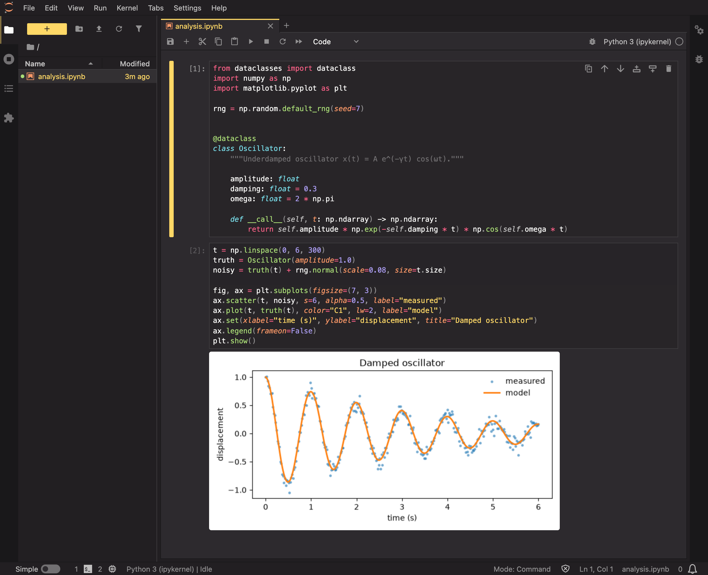
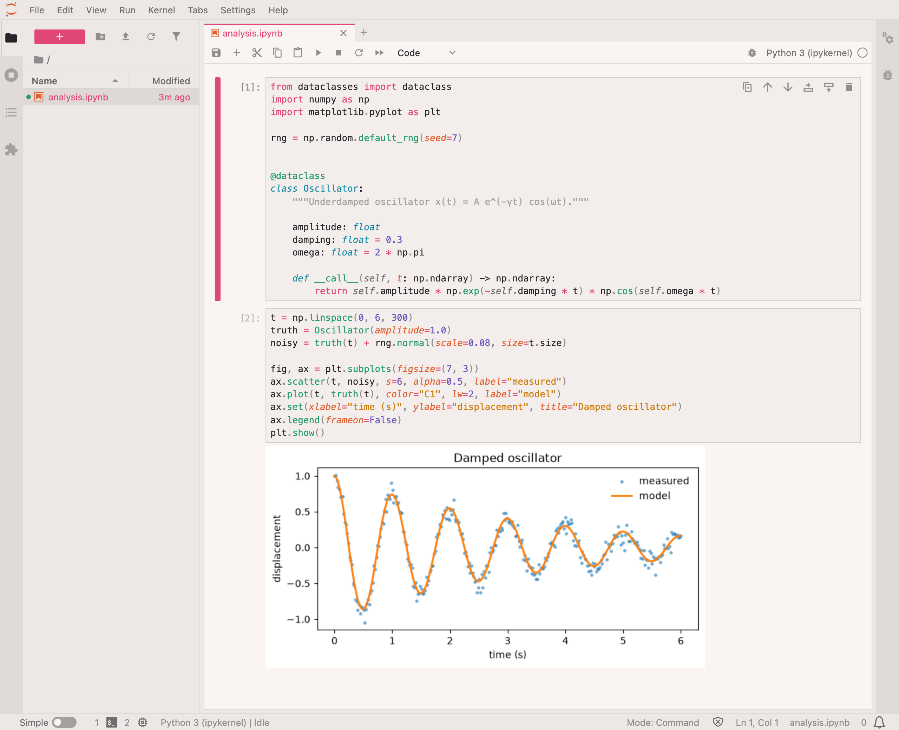

# Monokai Pro (CE) for [JupyterLab](https://jupyter.org)

## About this theme

This Monokai Pro Community Edition (CE) theme is maintained by [Brian Soong](https://github.com/brianysoong) and is based on the original [Monokai Pro](https://monokai.pro) theme.

[Installation instructions](INSTALL.md)

[MIT License](LICENSE.md)

## What's included

- **Monokai Pro (CE)** and **Monokai Pro Light (CE)**, selectable under _Settings → Theme_. They use the official Monokai Pro and Monokai Pro Light palettes.
- **Syntax highlighting that matches Monokai Pro for VS Code.** JupyterLab normally gives every keyword the same color. This theme separates them: `def`, `class` and `lambda` are blue italic, while control flow such as `if` and `return` is red. Python also gets orange italic parameters and keyword arguments, italic `self`/`cls`, dimmed docstrings, green decorators, and blue italic builtin types, exceptions and base classes. Code blocks in rendered Markdown are highlighted the same way as code cells.
- **The rest of JupyterLab follows Monokai Pro's own layering and selection style.** Side panels, the activity bar and the status bar sit on darker shades of the editor background. The current tab, the active cell and the selected file are marked with the Monokai highlight color (yellow in the dark theme, red in the light one) rather than solid fills. The command palette, menus, the completer, dialogs, search matches and the settings editor follow the same pattern.
- **ANSI colors** in outputs, tracebacks and the terminal use Monokai Pro's terminal palette.
- **Readable transparent figures.** Plots saved with a transparent background usually have dark text that disappears on a dark theme. In the dark theme, image outputs get a white backing, so they look as they would on paper. You can change this under _Settings → Settings Editor → Monokai Pro (CE)_:
  - **White** (default): every image output and the image viewer.
  - **Auto**: only figures that ask for it. Matplotlib's inline backend does this for transparent figures with dark labels.
  - **None**: never.

Requires JupyterLab 4 (also works in Notebook 7).

## Monokai Pro for more apps

